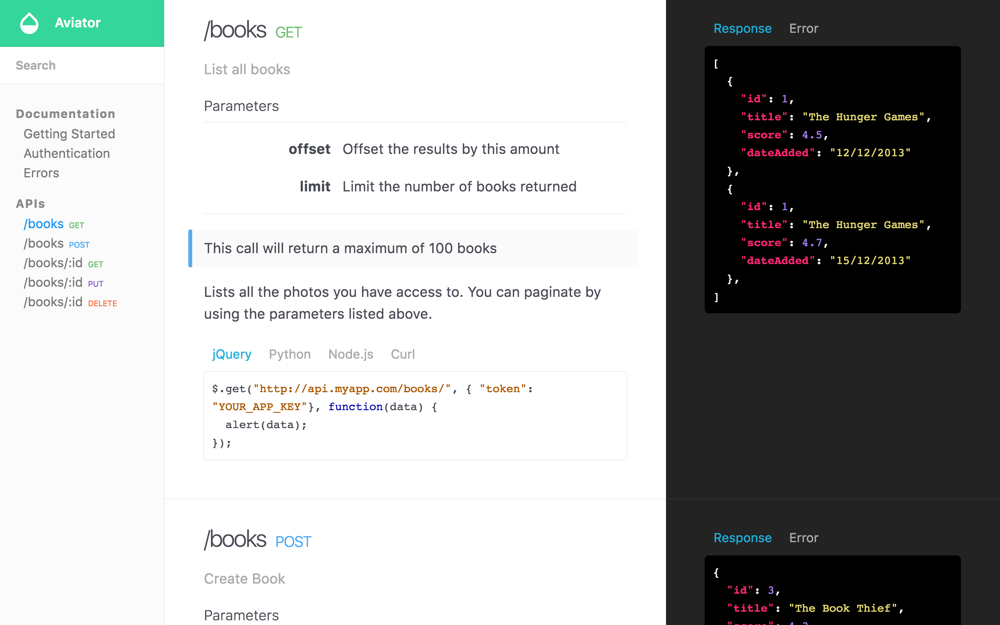

# CarTrawler

API documentation template for Jekyll. Browse through a [live demo](https://tangerine-lemon.cloudvent.net/).
Start documenting your API with this configurable theme.

CarTrawler was made by [CloudCannon](http://cloudcannon.com/), the Cloud CMS for Jekyll.
Find more templates and themes at [Jekyll Tips](http://jekyll.tips/templates/).

Learn Jekyll with step-by-step tutorials and videos at [Jekyll Tips](http://jekyll.tips/).

## Features

* Three column layout
* Fully responsive
* Full text search
* Pre-styled components
* Auto-generated navigation based on category
* Optimised for editing in [CloudCannon](http://cloudcannon.com/)
* SEO tags
* Google Analytics

## Setup

1. Add your site and author details in `_config.yml`.
2. Get a workflow going to see your site's output (with [CloudCannon](https://app.cloudcannon.com/) or Jekyll locally).

## Develop

CarTrawler was built with [Jekyll](http://jekyllrb.com/) version 3.1.6, but should support newer versions as well.

Install the dependencies with [Bundler](http://bundler.io/):

~~~bash
$ bundle install
~~~

Run `jekyll` commands through Bundler to ensure you're using the right versions:

~~~bash
$ bundle exec jekyll serve
~~~

### Docker
You can also use [Docker](https://formulae.brew.sh/formula/docker) if you don't want to install the dependencies manually, it's super easy you just need to run: 
~~~bash 
docker-compose up 
~~~

After docker-compose finish its work you'll be able to access the page in the following address:

http://localhost:4000
 
or
 
http://0.0.0.0:4000

** Make sure you have Docker set up on you machine, if you don't you can easily install using [brew install](https://formulae.brew.sh/formula/docker)

## Editing

CarTrawler is already optimised for adding, updating and removing documentation pages in CloudCannon.

### Usage

* Each section is a different collection, this helps organise your content.
* Set the order of the collections with the position field in collection configuration in `_config.yml`.
* Set the order of the documents inside a collection by setting the position in front matter.

### Search

* Add `excluded_in_search: true` to any documentation page's front matter to exclude that page in the search results.
